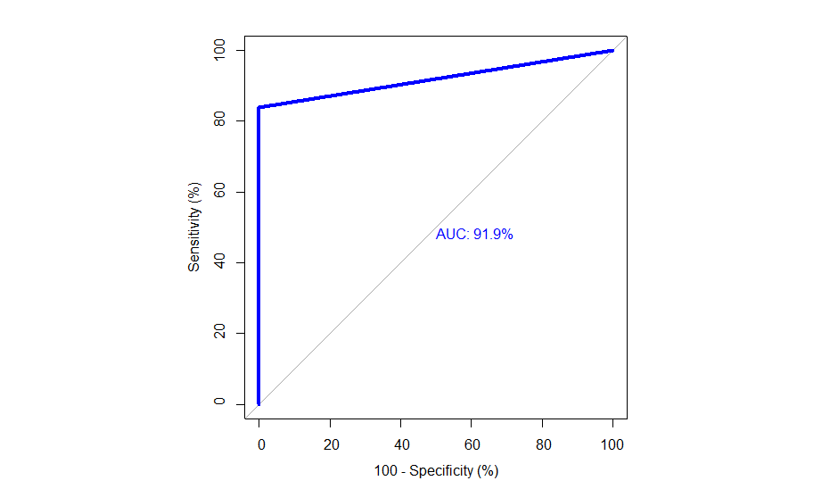

```{r setup, include=FALSE, cache=FALSE}
knitr::opts_chunk$set(echo = TRUE)

library(tidyverse)
library(caret)
library(randomForest)
library(neuralnet)
library(smotefamily)
library(scales)
library(corrplot)
library(pROC) 
```

```{r loaddata, echo = FALSE}
setwd("C:/Users/User/Documents/RProjects/Capstone Project/Credit_Card_Fraud")
load("Workspace_Credit_card_fraud.RData")

```
\newpage
# Introduction

In the modern world, credit card purchases have become indispensable. There are several reasons why digital banking is superior to cash payments and is becoming more and more popular. However, the digital system also has some weaknesses, most of which come from the user. Carelessness and negligence on the internet make users vulnerable and open up ways for criminals to authenticate fraudulent credit card purchases. For this reason, banks are willing to invest a lot of money to detect these frauds with the aim of protecting their customers and maximizing their satisfaction with the bank's service.

Of all the criminal acts in the financial sector, credit card fraud is the most widespread and has the greatest negative impact due to the ease and sheer volume in which it occurs.Although many companies take serious measures to combat and prevent these scams, they can never be completely eradicated because the criminals eventually find a weakness in these measures. The benefits of fraud detection technology still outweigh the risks of the large investment and inconvenience caused. Therefore, combating fraud activities by continuously improving data mining and machine learning is one of the most important approaches to prevent the losses caused by illegal activities.

In this practical approach we want to use different machine learning models to identify fraudulent credit card transactions. In addition to overall accuracy, we pay particular attention to the ratio of specificity and sensitivity, as we want to detect as many fraudulent transactions as possible but not on the cost of false positive detection of non fraudulent transactions.

## Dataset

The dataset is very imbalanced, only 0,017% of transactions are fraudulent while the rest represents legitimate transactions. The described imbalance forms a problem for predictive modeling as most of the machine learning algorithms which are used for classification were designed to be applied to balanced dataset. In many cases the minority class is the class of interest, so it is in credit card fraud detection. In order to overcome this problem we will use Synthetic Minority Oversampling Technique (SMOTE). The SMOTE algorithm can be described as follows:

1. Take the difference between a sample and its nearest neighbor  
2. Multiply the difference by a random number between 0 and 1  
3. Add the difference to the sample to generate a synthetic example in the feature space  
4. Continue with the next nearest neighbor up to the user defined number    

Lets assume we have an imbalanced dataset. We plot a subset of the minority class in order to visualize the idea of SMOTE. For simplicity we only consider two features, although we can imagine that the subsequent steps may take place in a N-dimensional space.

```{r, echo=FALSE, out.width="100%"}

smote_example

```

We consider the first row of a dataset and compute the k nearest neighbors for this data point. We select a random nearest neighbor out of the k nearest neighbors, and compute the difference between the two points. This difference is multiplied by a random numeric between 0 and 1. The resulting value represents a synthetic example along the dashed line between these two points. The number of repetitions of this process, is depending on the amount of synthetic data we want to generate. The number of duplicates can be calculated by the following formula:

$$
n = \frac{1-r_0}{r_0} \cdot \frac{n_0}{n_1} -1
$$
$$
r_0 = desired\;ratio
$$
$$
n_0 = number\;of\;rows\;corresponding\;to\;the\;majority\;class
$$
$$
n_1 = number\;of\;rows\;corresponding\;to\;the\;minority\;class
$$

The SMOTE algorithm has some advantages in comparison to other balancing techniques. We generate synthetic data which are not just a copy of other existing data points so we avoid over fitting like its often times the case with the simple up sample algorithm. Down sampling would be even worse since the machine learning algorithms we want to apply on our dataset would have less training data to learn from.

## Model evaluation

Credit card fraud detection is a classic binary classification problem. There are two possibilities, either the purchase is valid or it is fraudulent. In order to describe the performance of our classification models we use a confusion matrix and receiver operating characteristic (ROC).

```{r, echo=FALSE, message=FALSE,out.width = '70%',warning=FALSE,  fig.align='center'}

layout(matrix(c(1,1,1))) 
par(mar=c(2,2,2,2)) 
plot(c(100, 345), c(300, 450), type = "n", xlab="", ylab="", xaxt='n', yaxt='n') 
title('CONFUSION MATRIX', cex.main=2) 

# create the matrix 
rect(150, 430, 240, 370, col='#3F97D0') 
text(195, 435, 'Legitimate', cex=1.2) 
rect(250, 430, 340, 370, col="#FF817E") 
text(295, 435, 'Fraud', cex=1.2) 
text(125, 370, 'Predicted', cex=1.3, srt=90, font=2) 
text(245, 450, 'Actual', cex=1.3, font=2) 
rect(150, 305, 240, 365, col="#FF817E") 
rect(250, 305, 340, 365, col='#3F97D0') 
text(140, 400, 'Legitimate', cex=1.2, srt=90) 
text(140, 335, 'Fraud', cex=1.2, srt=90) 

# add in the cm results 
text(195, 400, "TP", cex=1.6, font=2, col='white') 
text(195, 335, "FP", cex=1.6, font=2, col='white') 
text(295, 400, "FN", cex=1.6, font=2, col='white') 
text(295, 335, "TN", cex=1.6, font=2, col='white')

```

In a confusion matrix, the number of correct and incorrect predictions are compared.As we can see in the table a confusion matrix gives us a quick overview how many predictions for the two binary outcomes TRUE and FALSE (resp. 1 and 0) are actually right and wrong. With sensitivity we describe the ability of our algorithm to predict a positive outcome when the actual outcome is positive. This metric on its own is not enough to judge if our algorithm works well. The algorithm could predict always TRUE and cover all the cases in where the actual value is TRUE and we would measure a sensitivity of 100%. In this case we would ignore all cases where the model predicts TRUE although the actual value is FALSE. This why we also examine the specificity which is a metric for the ability of the algorithm to predict FALSE, when the actual value is FALSE.   


The mathematical description for sensitivity (True Positive Rate) and specificity (True Negative Rate) is the following:

$$
TPR = \frac{TP}{TP + FN}  
$$
$$
TNR = \frac{TN}{TN + FP}  
$$
Besides these metrics its common to calculate the overall accuracy, precision, prevalence F-Score and Cohen's Kappa for binary classifiers. The overall accuracy is defined as:

$$
ACC = \frac{TP + TN}{Total}
$$
The problem with the overall accuracy alone as a metric is similar to the use of sensitivity. Depending on the dataset and the ratio of actual negative and positive values, we can achieve a high accuracy like close to 100% with a high sensitivity but still have a very low specificity. 

The precision is the ability of a model to predict TRUE when its actually TRUE:

$$
PREC = \frac{TP}{TP + FP}
$$
The prevalence is a metric for the actual number of TRUE (NOT) that occurs in our dataset:

$$
PREV = \frac{NOT}{TOTAL}
$$
The F-Score is a weighted average of TPR and precision:
$$
F1 = \frac{2 TP}{2TP+FP+FN} = 2 \cdot \frac{PREC \cdot TPR}{PREC+TPR} = \frac{1}{\frac{1}{2}(\frac{1}{TPR}+ \frac{1}{PREC})}
$$
In receiver operating characteristics the true positive rate(sensitivity) is plotted versus the false positive rate (1- specificity). For ROC-Plots the are under the curve (AUC) can be compared for different algorithms. The higher the area under the curve the better is the prediction by the algorithm.


## Data Science Process

The main steps in a data science project include:

1.	Data collection
2.	Data preparation
3.	Data exploration
4.	Data cleaning
5.	Data analyses and visualization
6.	Model building and validation
7.	Creating a report and publishing the results

\newpage

# Methods

## Data Collection/Preparation

The dataset is downloaded from [kaggle.com] and provides a huge dataset in .csv format with a size of 147,3 Megabyte. The dataset is PCA transformed so the features for each observation are obtained by principal compound analysis.

## Data Exploration

As a first step the we discover the structure of the dataset, we call the str() function in order to receive some information about the variables and datatypes in the data frame.

```{r}

str(creditcard)

```


We can see that the features V1-V28 obtained by PCA are hidden features due to confidentiality issues. Only Time, Amount and Class are known observations, while Class represents our desired value to predicted. The dataset contains 284807 observations and the datatype of all variables is numeric.

With the head() function we can call the first six rows of the data frame:

```{r}

head(creditcard)

```

In order to make sure that we don't have any missing values we check for missing values with the following line:

```{r}

colSums(is.na(creditcard))

```

Since all the columns are 0 we know that there is no missing values in our dataset.

## Data Cleaning

The Time feature contains the seconds elapsed between each transaction and the first transaction in the dataset. That means it is not so much an actual time but rather a kind of chronological order in which the transactions occur. Since this might not have any importance for our predictions we remove the time feature in a later step.


## Dataanalysis and Visualization

In this section we will visualize interrelationships and facts about the dataset. We will visualize the ratio of fraudulent and legitimate transactions, correlations between the features and dependencies of the known features time and amount.

### Imbalance

As already mentioned the dataset is very imbalanced. Only 0.017% of the transactions in the dataset are fraudulent. That means there is not so much training data for the used algorithms to learn from.

```{r echo=FALSE, message=FALSE, warning=FALSE,  fig.align='center'}

freq_plot

```

\newpage

### Amount of Transactions

In the following plot we show the amount of money which is transferred with the transactions.The boolean expression FALSE represents legitimate transaction, while TRUE represents a fraudulent transaction. 

```{r echo=FALSE, message=FALSE, warning=FALSE,  fig.align='center'}

amount_vs_class_plot

```

We can see that for non-fraudulent transactions the distribution of transferred amounts of money is much larger compared to fraudulent transactions.

\newpage

### Time 

The time feature is not an actual Date Time. It more represents the chronological order of transactions, since its the number of seconds that passed after the first transaction. With a plot of the number of transactions versus time we want to investigate if there is any anomalies. The class 0 represents non fraudulent transactions and the class 1 represents fraudulent transactions. 

```{r echo=FALSE, message=FALSE, warning=FALSE, fig.align='center'}

time_plot

```

\newpage

### Correlations

In order to see if there is any features that have strong correlations we are going to plot all the correlations between every feature of the dataset. 

```{r, echo=FALSE, message=FALSE, warning=FALSE, fig.align='center'}

corrplot(correlations)

```

We can see that there is no correlations between the features V1-V28. This is the result of the PCA transformation of this hidden features. Some of these features have stronger or less strong correlations to the known features amount and class. 

## Models

The underlying task is a binary classification problem. We select three of The most popular models for binary classification and compare the results of these models. We will perform logistic regression,a random forest and a neuronal network. Since the original dataset is largely imbalanced, we will use an up sampling method for the training sets of all three algorithms. We will also perform a k-fold cross validation on the training sets in order to find the best settings for the algorithms.

\newpage

# Results

## Logistic Regression

$$\\[0.1cm]$$
```{r echo=FALSE, message=FALSE, warning=FALSE,  fig.align='center', out.width = '70%'}

draw_confusion_matrix(CM_glm)

```


$$\\[0.1cm]$$
```{r, echo=FALSE, out.width = '100%',  fig.align='center'}

knitr::include_graphics("ROC_glm.png")

```

## Random Forest

$$\\[0.1cm]$$
```{r echo=FALSE, message=FALSE, warning=FALSE,  fig.align='center', out.width = '70%'}

draw_confusion_matrix(CM_RF)

```


$$\\[0.1cm]$$
```{r, echo=FALSE, out.width = '100%',  fig.align='center'}



```


## Neuronal Network
$$\\[0.1cm]$$
```{r echo=FALSE, message=FALSE, warning=FALSE,  fig.align='center', out.width = '70%'}

draw_confusion_matrix(CM_NN)

```

$$\\[0.1cm]$$
```{r, echo=FALSE, out.width = '100%',  fig.align='center'}

knitr::include_graphics("ROC_NN.png")

```


# Conclusion

Three different algorithms were used in order to classify if a transaction is legitimate or fraudulent. In order to overcome the negative influence of imbalance of the training data we performed Synthetic Minority Oversampling Technique on our training sets. All three methods gave really good results, however the neuronal network performs the best and gave perfect accuracy with 100% AUC. Logistic regression and the random forest model gave quite similar results with 94.0% AUC and 91.9% AUC. The sensitivity of the random forest is better than the one of logistic regression but the specificity of logistic regression is better than the one of the random forest. One might think its more important to focus on specificity since we want to detect fraudulent transactions but i guess both specificity and sensitivity are very important since every false positive and false negative prediction has an influence on costumer satisfaction. In case of logistic regression much more non-fraudulent transactions were classified as fraudulent compared to the random forest model. However the random forest takes much more time for computation. The neuronal network not only gave the best result it also has the shortest run time. So considering results and run time the neuronal network performed the best by far.   

## Limitations

Even if the results for the random forest and logistic regression have high ROC-AUC percentages I could imagine that its possible to achieve better results with better tuning. Especially the run time for the random forest made it hard to perform more tuning since a k-fold repeated cross validation on this algorithm takes several hours of computation.  

The interpretation of the important variables for our predictions is simply not possible since we don't know any information about the features V1-V28.


# References

1. Rafael A. Irizarry (2019), Introduction to Data Science: Data Analysis and Prediction Algorithms with R

2. https://cran.r-project.org/web/packages/smotefamily/smotefamily.pdf

3. https://cran.r-project.org/web/packages/neuralnet/neuralnet.pdf

4. https://cran.r-project.org/web/packages/caret/vignettes/caret.html


